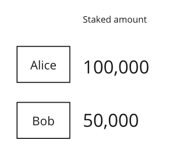
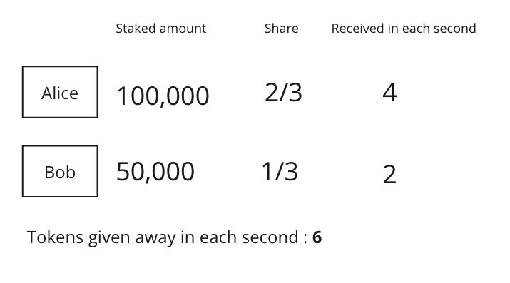
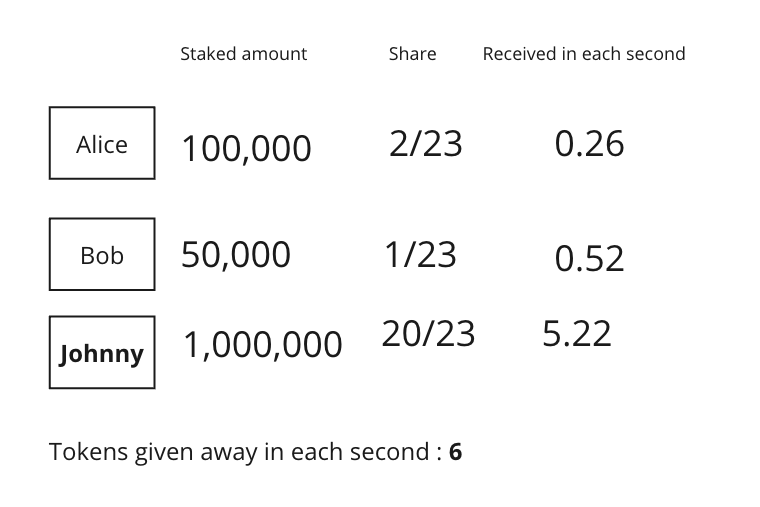
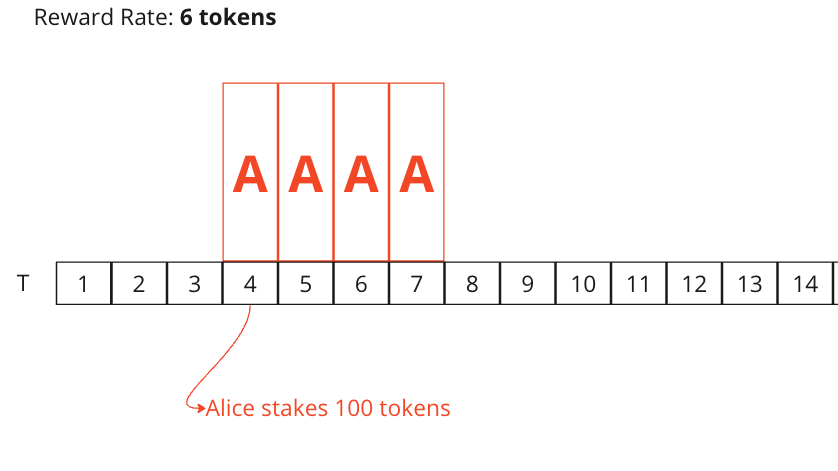
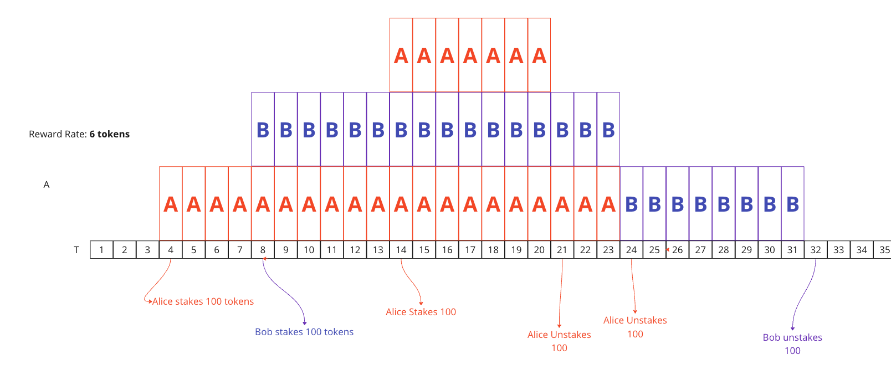

# Simple Staking Program With Solana
In this assignment you will be require to implement smart contract for single side staking and deploy it on Solana blockchain.

#### The Reasons
Web3 projects are highly dependent of the value of their assets - whether these are tokens or NFTs.
Value of these assets are mainly determined by demand - how much people want to buy and hold them.
If everyone wants to sell specified token, it's price will rapidly go down. So projects need ways
to incentivise people to hold their assets - the staking platform is one of those incentives.

The Staking is a process of locking some amount of tokens for a period of time in exchange for
receiving more tokens (same or other type). Tokens are usually locked in smart contracts
or **programs**, and users can't transfer them around during the locking time. Rewards are
usually proportional to the amount of tokens user is staking, the more tokens user stakes,
more rewards he will receive. These tokens are sometimes locked for a period of time and users
can not withdraw them until that period of time has passed. This mechanism incentivises users
to hold tokens for a longer periods of time, if a lot of users stake their tokens, there demand
for a token will increase because there will be less people wanting to sell their assets.

The reward system varies accordingly to company needs, but in our assignment we will go with the
most traditional approach - total received rewards for a user will be dependant on several things:

* The amount of tokens user has staked *(the bigger the better)*
* The time period those tokens were staked *(the longer the better)*
* The percentage of your share of tokens in total pool of staked tokens

**Amount of tokens the project gives out will be fixed**

Let's clarify those rules with an example:

The project A announces that their staking program will be giving away **6 Token A** in each second.
those 6 tokens will be proportionally split among stakers in accordance to their share in
total pool.

Let's say there are 2 users who want to stake their tokens: Alice and Bob, Alice stakes 100K of token A
and Bob stakes 50K of token A.



So alice' share is 2/3 and Bob's share is 1/3 in the total staking pool,
so those 6 reward tokens will be split accordingly:


so if both stake those tokens at the same time,
after 20 seconds, alice will have accumulated reward of **80 tokens** and bob will have
**40 tokens**.

let's say after those 20 seconds third user, Johnny decides to also stake some tokens,
He chooses to stake 1M tokens.
So shares will change accordingly



So it seems like johnny is dominating the pool now by taking the majority of the total share.
This doesn't look so good for alice and bob, they will have to stake more to match with johnny.
In current peace in one day johnny will get **450k tokens**, when alice and bob will get fraction of this amount.

I hope you got an idea of the rewarding principle. this approach is also good for the project because they
know exactly how many tokens they will have to give away after certain period of time.

#### The Algorithm

An example we introduced above is pretty simple, in real world scenario there might be thousands of users
and each time they might be staking and unstaking the portion of the tokens, so each time it might be hard
to calculate what is the amount of rewards each user receives.

When the user decides to stash out the rewards our program dynamically should be able to calculate
their accumulated amount. Let's consider an example with time periods:


we will express passage of time in seconds with variable T.

Let's say on time T=4 alice decided to stake 4 tokens



* T = 8: Bob stakes 100 tokens
* T = 14: Alice stakes 100 more tokens
* T = 21: Alice unstakes 100 tokens
* T = 24: Alice unstakes 100 tokens
* T = 32: Bob unstakes 100 tokens

so when alice decides to receive her tokens, our smart contract should be able to determine how
many tokens she earned by staking. the naive approach would be to loop through all the points in time,
calculate alice's reward for each time slot individually and sum up the results.
for example if alice wanted to get the rewards, our program would do something like:

```rust
let mut total_reward = 0;
for t in time_slots {
    total_reward += staked_by_alice[t] / total_staked[t] * reward_rate;
}
```

this seems like the correct approach, but the nature of the smart contract makes this kind of
implementation really difficult. The main reason is that smart contract may only change it's state
when someone interacts with it, the users won't be interacting with the smart contracts each second.
also it would be infeasible to store state of the program each second, several thousand users
may be staking and unstaking periodically so we can't save 1000 separate data entries for each second,
the program may be deployed for years, that type of storage requirements are too much for solana to handle.

Fortunately there is another way to implement this:
If you pay attention to the graph above, there are certain segments of time, where the state of
program is constant! These segments are bounded by user interactions, so between any two user interactions
we can calculate the reward accumulated by each user by simple formula with a constant time complexity.
for example between time slots **14 and 20** alice has staked 200 tokens and bob has staked 100 tokens,
so alice recieves 4 token a second and bob receives 2. as this segment has 7 time slots, the total reward
accumulated for alice for example will be 4 * 7 = 28 tokens.

our smart contract can calculate this number, when alice interacts with a program and unstakes part of his tokens
at T = 21.

I won't be explaining the exact algorythm how to do it, because there is a set of videos on youtube, that
does this better than me:

[Synthetix Staking Explained](https://youtu.be/6ZO5aYg1GI8) - Please watch all 4 parts before proceeding.
The algorithm is the same as what we are trying to implement, The only difference being that
These videos also explain the implementation in Solidity.

To sum up the videos, smart contract can calculate the rewards received by user in a specific period of time,
if amount of tokens staked by this user was constant in this period of time.
for example between tiime slots [8,24] bob's staked amount was 100 tokens, so the formula let's
us calculate amount of reward tokens when bob unstakes at T = 25.
In order to achive this, our program keeps track of variable named `reward_per_token_staked`, which
is the reward amount received if you stake one token, basically it's `1/total_tokens_staked * reward_rate`
summed up per all time slots.
Program also should keep track what this number was equal to when specific user interacted with a program for the last time,
we call this variable `reward_per_token_paid`, and it's calculated for each user individually.

so when bob unstakes his tokens at T = 25, you can calculate what was the amount he accumulated
with the formula: `reward_per_token_staked * bobs_staked_amount - reward_per_token_paid`.
something like this, this would become clearer once you have watched videos I linked above.


### The Implementation

The starting files are provided to you in `./src` directory, there's only one empty entrypoint
function.
To build the project type in terminal:
```shell
> cargo build-sbf
```
to deploy the program:
```shell
> solana program deploy ./target/deploy/blockchain_technologies_assignment_4.so
```

### requirements of the program

##### accounts
You probably need to have 2 types of accounts in your program.\
**Global State Account** - an account which keeps global data and configuration for staking pool.
an example:
```rust
pub struct PoolState {
    pub initializer: Pubkey,
    pub total_staked_tokens: u128, 
    pub reward_per_token_stored: u128, 
    pub token_mint: Pubkey, 
    pub treasury_pda: Pubkey, 
    pub treasury_token_account: Pubkey, 
    pub reward_rate: u64, 
    pub last_update_time: i64, 
}
```
* `initializer` - the person who created a staking pool, you can use this field to enable elevated privileges for the
  creator of the pool.
* `total_staked_tokens` - number of total tokens locked up in our staking pool
* `reward_per_token_stored` - this is one of the values described in an algorithm above, this field
  stores reward received per one token stored summed up from the beggining of the staking pool. the value
  is re-calculated every time someone interacts with program - stakes or un-stakes their tokens.
* `token_mint` - the token which will be used for staking pool as well as for rewards, staking and reward
  tokens may be different, but in favour of simplicity we will have only one token.
* `treasury_pda` - an address which will have authority to give away rewards to users. Naturally this
  will be a Program Derived Address, in order to allow program to sign in it's place.
* `treasury_token_account` - token account for treasury pda
* `reward_rate` - how many tokens are distributed among stakers each second
* `last_update_time` - this is the last timestamp someone interacted with program: staked or unstaked his tokens

remember that these fields are only an example of implementation, you are free to change them or use your kind of implementation,
as long as it satisfies above requirements.\
`Pool State` account should be owned by our staking program, you can make it as PDA but it's not required,
also users should be able to create different staking pools with different configurations, so that everyone
is able to create their own staking pools with different configurations like `token` and `reward rate`


**User State Account** - This account will store staking data specific for a user.
an example:

```rust
pub struct UserState {
    pub initializer: Pubkey, 
    pub pool_state_account: Pubkey, 
    pub staked_token_amount: u128,
    pub rewards_per_token_paid: u128, 
    pub rewards: u64, 
    pub last_interaction_time: i64,
}
```
* `initializer` - the user who created the staking account
* `pool_state_account` - the pool account which this user state account belongs to, as there may be
  several staking pools governed by our program, one user may have staking accounts in each of the pools
* `staked_token_amount` - amount of tokens user has staked so far
* `rewards_per_token_paid` - this variable is also part of the algorithm explained above, this stores what
  was the value of `pool_state.reward_per_token_stored` then the user interacted with a program last time.
* `rewards` - this stores the amount of rewards user has accumulated on his last program interaction
* `last_interaction_time` - timestamp on which user has interacted with the program for the last time.

#### Serialization
you are free to use any serialization algorithm you want, but I recommend using [Borsh](https://borsh.io/) - it's pretty
simple to use and pretty much everyone developing solana programs uses it.

#### Instructions
There will be 7 types of instructions your program should be able to handle

* **Initialize Staking Pool** - should let you create and initialize staking pool account with
  specified values, If this is a PDA, CPI call to the system program should be made to create
  account, otherwise user can create an account in separate instruction, and just pass created account to this one.
  In latter case you should check that user passed account with correct size and lamports to initialize.
* **Launch Staking** - Simple instruction to allow users to start staking their tokens, untill staking pool is launched,
  no one should be able to stake tokens. also Only pool initializer should be able to call this instruction.
* **Create Staking Account** - instruction to create state account for an user. amoung other accounts, you should pass
  staking pool account to this instruction as well, to sort of assign specific account to specific pool. also there should be no
  possibility for a user to have more than one account for single staking pool, so it would be better Idea for this account to
  be a PDA.
* **Stake Tokens** - allows user to stake tokens, when this method is called, `reward_per_token_stored`, and
  `rewards_per_token_paid` values should be recalculated. also if user had staked tokens before this interaction,
  accumulated reward amount should be added to `rewards` field in the user account. Naturally when this instruction is performed
  the specified amount of tokens should be sent from user's account to the programs PDA account to be locked.
* **Unstake Tokens** - unlocks tokens for the user. `reward_per_token_stored` and `rewards_per_token_paid` values should be recalculated here
  as well. user can unstake any amount, as long as it is not greater than what he has locked so far. one CPI call to the token transfer
  should happen here as well,
* *Get Rewards* - transfer accumulated rewards from the program's treasury account to the user's specified token account.
* **Close Stake Account** - closes users staking account. if account contains rewards or staked tokens, instruction should not
  allow user to close it.

#### Additional Requirements

This assignment only requires you to implement the program. Client is completely optional, but you won't be
able to test your program without writing up some sort of client.

Any severe vulnerability in your program will result in point deduction, but I won't be paying any attention
to minor ones that won't cause your whole balance to drain or that are hard to reproduce.

This document might receive changes it it appears to be hard for the majority of students.


